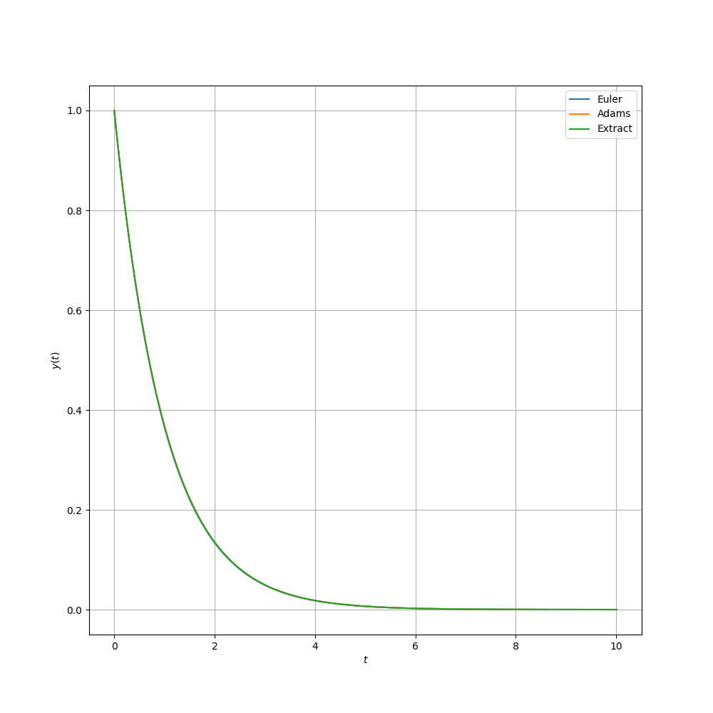

## Scipy.integrate.odeint

adams法とオイラー法の数値計算の誤差をみる。

---
Scipy.integrate.odeint : FORTRAN77

- ODEPACK
	- DLSODA
		- 9種類の常微分方程式の解法

-----

### 豆知識

ODEPACKは
[Netlib](http://www.netlib.org/master_counts2.html#odepack)によって開発されている.

ソースコード：[odepack](https://www.netlib.org/odepack/index.html)

-----

- ソースコードを見てみよう : [ODEPACK](https://people.sc.fsu.edu/~jburkardt/f77_src/odepack/odepack.html)
	
	- この中にLSODAがある : [odepack_prb3.f](https://people.sc.fsu.edu/~jburkardt/f77_src/odepack/odepack_prb3.f)
		- 出力ファイルがリファレンスに有る : 
[odepack_prb3_output.txt](https://people.sc.fsu.edu/~jburkardt/f77_src/odepack/odepack_prb3_output.txt)

-----

読めたと思う？
読めへん。

-----

- ところで、どのadams法か？
	- 記載なし
    	- 陽解法がいいのか？
		- adams-multon-bashforce法かな

-----

メインテーマ

- Scipy.integrate.odeint（Adams法）
- オイラー法
- 厳密解

この３つを比較してみよう

-----

- 放射性崩壊の方程式: $\frac{dy}{dt} = -y$ について数値計算を行った.

- 差がほとんどないようにみえる|

-----

