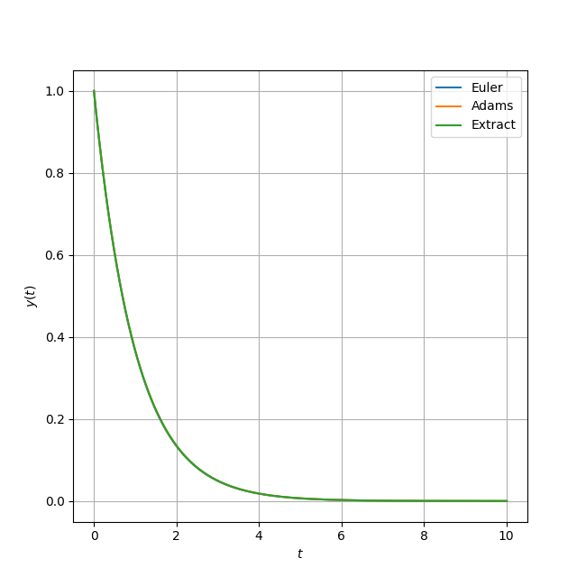
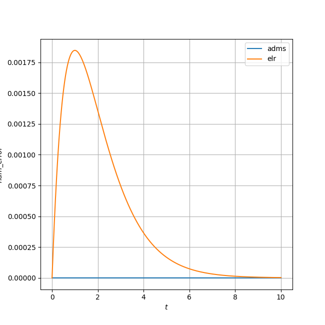

## Scipy.integrate.odeint

adams法とオイラー法の数値計算の誤差をみる。

---
Scipy.integrate.odeint : FORTRAN77

- ODEPACK
	- 9種類の常微分方程式の解法
		- DLSODA

-----

### 豆知識

ODEPACKは
[Netlib](http://www.netlib.org/master_counts2.html#odepack)によって開発されている.

ソースコード：[odepack](https://www.netlib.org/odepack/index.html)

-----

- ソースコードを見てみよう : [ODEPACK](https://people.sc.fsu.edu/~jburkardt/f77_src/odepack/odepack.html)
	
	- この中にLSODAがある : [odepack_prb3.f](https://people.sc.fsu.edu/~jburkardt/f77_src/odepack/odepack_prb3.f)
		- 出力ファイルがリファレンスに有る : 
[odepack_prb3_output.txt](https://people.sc.fsu.edu/~jburkardt/f77_src/odepack/odepack_prb3_output.txt)

-----

読めたと思う？

読めへん。

-----

- ところで、どのadams法か？
	- リファレンスには記載なし
    	- (陽解法がいいのか？)
		- adams-multon-bashforce法？

-----

メインテーマ

- Scipy.integrate.odeint（Adams法）
- オイラー法
- 厳密解

この３つを比較してみよう

-----

- 放射性崩壊の方程式: $\frac{dy}{dt} = -y$ について数値計算を行った.

-----

- t:[0,10], len(t) = 1002

-----

-----

- 差がほとんどないようにみえる
- 数値誤差を比較してみよう

-----

---

- adams法は厳密解と比較してほぼ正確に描画できている
- Euler法は誤差が一旦広がってその後収束している？
	- 変化率の大きいところでは誤差が大きく, 変化率の少ないところでは誤差が小さい

---

Adams法は優秀

fin.